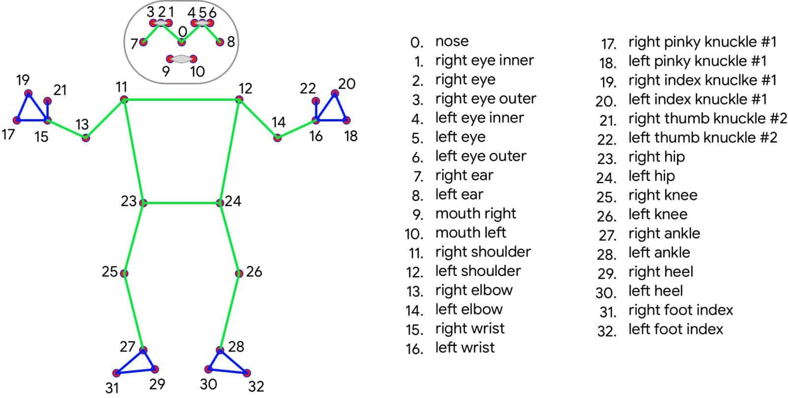

# AI Bicep-Curl Reps Counter

Welcome to the AI Bicep-Curl Reps Counter project! This project focuses on utilizing Deep Neural Networks (DNN) for pose estimation to automatically detect the number of reps when a user is performing bicep curls.

## Overview

This is my debut project in the realm of "Pose Estimation using DNN". The core functionality of this project lies in its ability to accurately count bicep curl repetitions by analyzing the user's movements.

## Acknowledgements

This project drew inspiration from Nicholas Renotte's insightful YouTube tutorial titled ["AI Pose Estimation with Python and MediaPipe | Plus AI Gym Tracker Project"](https://www.youtube.com/watch?v=06TE_U21FK4). The accompanying code and resources can be found on his [GitHub repository](https://github.com/nicknochnack/MediaPipePoseEstimation/blob/main/Media%20Pipe%20Pose%20Tutorial.ipynb).

## But what's additional compared to Nicholas
My model can detect and count reps for both left and right arm angles.
whereas Nicholas code only implements recording the left arm angle.

## Tech Stack

- **OpenCV**: Utilized for image processing and computer vision tasks.

- **MediaPipe**: Employed for real-time pose estimation.

- **NumPy**: Used for efficient numerical computations.

## How it Works

The system operates by detecting and analyzing the user's arm movements. It is designed to function only when both arms are actively performing bicep curls. Currently, the counter accurately identifies the number of repetitions during the exercise.

## Future Goals

- Implementing custom dataset training to enhance accuracy and versatility.
- Increasing the no. of Landmarks for more accurate predictions.
- Extending functionality to recognize and count repetitions for additional exercise positions.
- Incorporating text-to-speech functionality to provide real-time feedback to the user.
- Automatic recognition of the type of exercise being performed by the user.
- Compairing thr user's performance with an expert.

## Coorect Predictions

1. correct-predict-1

2. correct-predict-2

## Identified Flaws and Areas for Improvement

1. The model's performance may degrade when the test person's movements are excessively frequent or erratic.

2. Sometimes, the system might think that just folding your arms casually is the same as doing a bicep curl.

3. If an object is placed b/w the biceps(like-barbell curl),model fails.

4. This is not a bicep curl.

Thank you for exploring this project!
